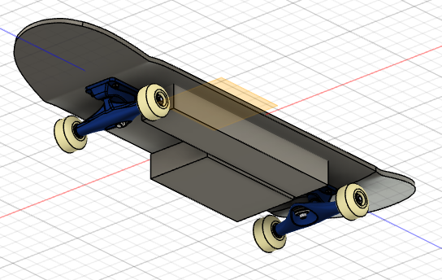
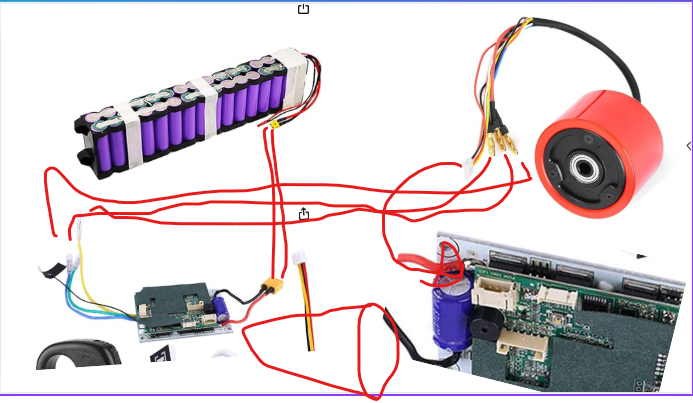

# Electric Skateboard with Pressure Sensor Acceleration
[Read the project build journal](journal.md) for detailed progress updates and technical notes.
## Description
This is a custom-built electric skateboard that uses two pressure sensors placed on the deck to detect foot pressure and control acceleration. The onboard controller reads analog input from the sensors and adjusts motor speed accordingly.

## Why I Made This
I wanted to experiment with an intuitive way of controlling personal electric vehicles without handheld remotes. Using foot pressure allows for a more natural ride and frees up the rider's hands.

## Images
### Physical Build (not done yet)

### Full 3D Model

### Wiring Diagram (It looks silly ik, but its pretty self explanatory)

## Bill of Materials (BOM)

| Item                | Description                                                        | Qty | Unit Price (USD) | Total Price (USD) | Notes                        |
|---------------------|--------------------------------------------------------------------|-----|------------------|-------------------|------------------------------|
| Longboard Wheels    | LOOEEL 70mm Longboard Wheels 80A (with ABEC-9 Bearings, Spacers)   | 1   | $21.99           | $21.99            | Black                        |
| Pressure Sensors    | Thin Film Pressure Sensor 20g-2Kg (4pcs)                           | 1   | $12.99           | $12.99            | For foot pressure detection   |
| Battery Pack        | OTRIEK 36V Scooter Battery Pack 10Ah                               | 1   | $65.89           | $65.89            | 10S Li-Ion                   |
| Hub Motor           | Generic 70mm 150W 24V/36V Brushless Hub Motor Wheel                | 1   | $59.29           | $59.29            | Black                        |
| ESC Kit             | Electric Skateboard ESC Kit 10S 36V (with Remote)                  | 1   | $67.16           | $67.16            | Single drive                  |
| Microcontroller     | Raspberry Pi Pico                                                  | 1   | $4.00            | $0            | For sensor/ESC control, I have it|
| **Subtotal**        |                                                                    |     |                  | **$227.32**       |                              |

You can also download and open [bom.csv](bom.csv) directly to see all rows.

