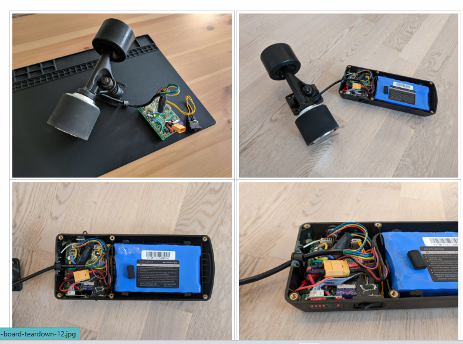
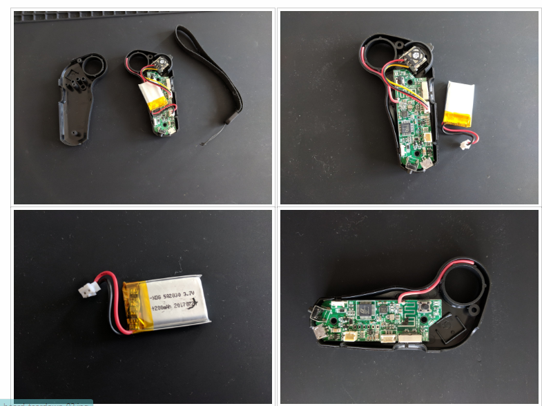
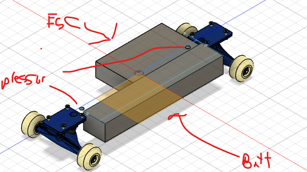
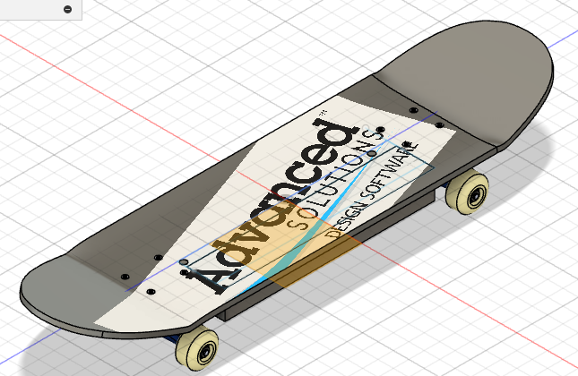
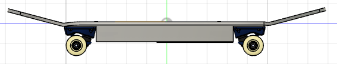
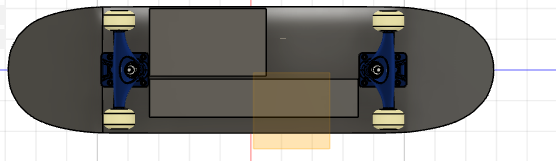
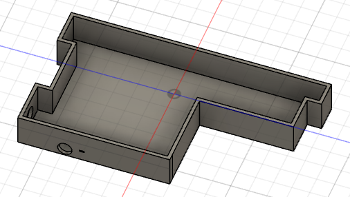
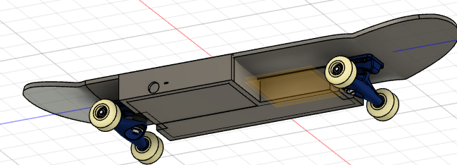

### Date: 2025-06-18  
**Time Spent:** 2.5 hours  
**Task:** Research — Understanding How Electric Skateboards Work  

**Summary:**  
I spent time reading documentation, tutorials, and teardown videos to learn the basic working principles of electric skateboards. Here’s a simplified overview of what I found:

**How Electric Skateboards Work:**  
- **Battery Pack:** Powers the entire system. Usually a multi-cell lithium-ion pack (e.g. 6S or 10S) that provides the voltage needed for the motor and electronics.  
- **ESC (Electronic Speed Controller):** Acts as the brain of the skateboard. It regulates how much power goes to the motor based on user input. It also controls braking by reversing the motor’s current.  
- **Motor:** Typically a brushless DC motor (BLDC). This converts electrical energy into mechanical rotation that drives the wheels.  
- **Throttle Input:** Most e-boards use a wireless remote. In my case, I’m replacing this with two pressure sensors—one under each foot—to detect how hard the rider is pressing down. This signal will be processed to modulate motor speed.  
- **Microcontroller (e.g. PSoC or Arduino):** Reads sensor data and sends control signals to the ESC. In this project, this will be embedded into the skateboard deck via a custom PCB.  
- **Drivetrain:** Power is transmitted to the wheels either directly (hub motors) or through belts/pulleys (for torque control and easier motor swaps).


---
### Date: 2025-06-19  
**Time Spent:** 2 hours  
**Task:** Research — How to Replace Throttle with Pressure Sensor  

**Summary:**  
I found a great breakdown on how to replace the standard throttle lever input with pressure sensors that connect directly to the ESC via a microcontroller.


##  Key Concept

I’m replacing the analog throttle signal (from something like a potentiometer or Hall-effect trigger) with a pressure-based analog signal.

My goal is to generate the same type of output signal (PWM, analog voltage, or UART) that the ESC expects — just based on pressure sensor input.


##  What I’m Replacing

**Original:**

* Lever or trigger → potentiometer → voltage to ESC (e.g., 1V = no throttle, 3V = full throttle), once i get the controller I will decide on what to do 

**New System:**

* Pressure sensor(s) → microcontroller reads analog input → microcontroller generates correct output (PWM/analog/UART) to ESC

---

##  Implementation Steps

### 1. **Mount the Pressure Sensors**

* I’ll use two FSRs where the feet naturally apply pressure
* Sensors go under grip tape near the front and rear pads

### 2. **Connect Sensors to Microcontroller**

Each sensor connects to an analog pin with a voltage divider.

**Wiring for each FSR:**
```

[3.3V] --- [FSR] ---+--- [Analog Pin]
|
[10kΩ]
|
[GND]

````

I’ll likely use one sensor for throttle and one for braking or fine control.

orrrr

I'll use one sensor as a failsafe, ie in order to thottle both sensors must be stepped on, if not, no input from the microcontroller

### 3. **Code: Convert Pressure to Throttle Output**

#### Step A: Read sensor

```c
int pressure = analogRead(A0);  
````

#### Step B: Map to ESC expected range

Most ESCs take a PWM signal, analog voltage, or UART.

```c
int throttlePWM = map(pressure, 0, 1023, 1000, 2000);  // IDK how it works ill check some documentation later
```

#### Step C: Send to ESC

If ESC uses PWM:

```c
servo.writeMicroseconds(throttlePWM);  // using Servo library since im pretty sure servos uses pwm
```

If ESC uses analog voltage, I’ll need a DAC or filtered PWM which I am sure I can get past that using some other library or it has a feature on the rpi pico.

---

## Some things to be done during dev phase

### 1. **Failsafe**

Add logic so if pressure sensor is unplugged or stuck, throttle drops to zero and a repitition of my both feet on deck idea:

```c
if (pressure < 10) throttlePWM = 1000;
```

### 2. **Calibration**

Map the sensor range to actual pressure force:

```c
map(pressure, 200, 800, 1000, 2000);  // Tune for real use
```

### 3. **Smoothing**

Use a moving average or low-pass filter to prevent jitter(HOPEFULLY NEEDS ONLY SOFTWARE):

```c
smoothed = 0.8 * smoothed + 0.2 * pressure;
```

---

##  Summary

My pressure sensors become the new throttle input. The microcontroller acts as a translator:

* **Input:** pressure from feet
* **Output:** PWM or analog signal to ESC

As long as I match what the ESC expects, this setup should feel intuitive and eliminate the need for a handheld remote.


example of remote


---

### Date: 2025-06-20

**Time Spent:** 1.5 hours
**Task:** Research — Deciding to Mod an Existing E-Skateboard

**Summary:**
It would be way easir to just buy one and replace the esc, and wheels to upgrade it 

---

##  Why Modding an Existing Electric Skateboard Makes More Sense

### 1. **Cost Breakdown Shows Major Savings**

| Component              | DIY Cost (USD) | Prebuilt Equivalent Included     |
| ---------------------- | -------------- | -------------------------------- |
| 6374 BLDC Motor       | \$60           | Included                       |
| VESC or Generic ESC    | \$70           |  Included                       |
| 6S/10S Li-Ion Battery  | \$120          |  $70                       |
| Charger + Connectors   | \$30           |  Included                       |
| Skateboard Deck        | I have my own |  $139                       |
| Trucks + Wheels        | \$24           |  Included                       |
| Remote (for testing)   |Included with esc |  Included                       |
| Mounts, Brackets, etc. |comes with extra wheels |  Included  
|pressure sensor| $12                     |$12
microcontrollers+plus other stuff|i have|i have
| **Total DIY Cost**     | **\$346+**     | **\$230** for a full board |

Modding a \$139 prebuilt board saves a lot of money and includes everything mechanically tested and functional out of the box.
 Up to reviewer what way I should go. I would perfer the diy way since its more in hc theme
---

### 2. **Time Efficiency**

* **DIY Build Time:** \~20+ hours (mounting motor, aligning drivetrain, soldering battery pack, tuning ESC firmware, wheel calibration)
* **Modding Time:** \~6–8 hours (removing remote receiver, installing microcontroller, sensor calibration, testing signal interface)

I cut the mechanical hassle and go straight to coding and electronics, which is the core of my project.

---

### 3. **Component Compatibility is Already Solved**

* ESC and motor are already matched
* Battery voltage and current delivery are optimized
* Wheels and trucks are properly aligned
* No risk of burning out components from mismatched specs

This removes a lot of the unknowns that could delay development.

---

### 4. **Focus on What Matters: Control System**

Instead of splitting time across electrical safety, mount durability, and wheel calibration, I can concentrate on:

* Reading and filtering pressure sensor data
* Mapping analog input to PWM signals
* Tuning feedback and response curves
* Failsafe logic and user experience testing


---

### 5. **Easier Troubleshooting**

* If something doesn’t work, I’ll know it’s my code or sensor rather than a hardware issue.
* The stock ESC and motor system is known to function — I have a working baseline to compare with.

---

### 6. **Physical Safety**

* Cheap DIY builds can fail at high speed due to loose trucks or poor motor alignment
* Prebuilt boards go through factory QC and include mechanical reinforcements
* Less chance of mechanical failure during testing

---

### 7. **Fallback Option**

* If my pressure system fails or misbehaves, I can flip a switch (or rewire) back to remote input
* I can A/B test the remote vs foot pressure for better UX data

---

### 8. **Enclosure, Grip Tape, and Layout are Already Done**

* No need to 3D-print or CNC a battery/ESC enclosure
* No need to mount grip tape or drill holes for sensors
* Everything is ready for sensor integration, saving even more time

---

### 9. **Faster Iteration Loop**

* Mod > Test > Tweak cycle can happen in one afternoon
* Riding the board for real gives faster, more useful feedback on pressure response and braking behavior


 Here’s the Fusion 360 model entry formatted as a `JOURNAL.md` log:

---

### Date: 2025-06-21

**Time Spent:** 1 hour
**Task:** Design — Full Skateboard Layout in Fusion 360

**Summary:**
I created a complete 3D model of the electric skateboard in Fusion 360. The goal was to plan out the placement of every major component — sensors, battery, and ESC — to catch design issues early and prepare for physical integration.

---

##  Key Features of the 3D Model

### - Deck and Sensor Zones

* The deck layout includes zones for foot placement, with designated sensor areas near the front and rear pads.
* These regions will house the FSR pressure sensors under the grip tape, positioned where natural foot pressure is applied.

### - Electronics Enclosure

* There’s a compartment underneath the deck designed to hold the microcontroller, ESC, and all necessary wiring.
* The enclosure is sized for easy access and heat dissipation, and it has enough clearance to swap boards or reprogram the microcontroller if needed.

### - Battery Placement

* I placed the battery centrally as possible under the deck to maintain a balanced center of gravity.
* There’s additional clearance for wiring and connectors, with channels modeled to route cables cleanly to the ESC.

### - Motor and Wheel Assembly

* The model uses a standard single rear-wheel configuration with a single BLDC hub motor.
* I modeled the motor mount and truck spacing to align with common commercial builds, ensuring mod compatibility.

### - Modding-Friendly Design

* Space is reserved in the enclosure for both the original ESC/receiver and the new microcontroller setup.
* This allows for quick switching between the default remote throttle and my foot-pressure-based system if needed.

---


---






Next step: Begin preparing cutouts for the enclosure.


---

### Date: 2025-06-23

**Time Spent:** 45 minutes
**Task:** Fabrication — Cutting Out the Enclosure Bay in the Deck

**Summary:**
I cut out the bottom section of the deck to create space for the electronics enclosure. This will eventually house the ESC, microcontroller, and supporting circuitry once the hardware arrives. For now, it's just a basic shell — no mounting holes or component slots yet.

---

##  Enclosure Cutout Overview

* The cutout follows the general layout from the Fusion 360 model
* I focused only on removing material to define the space for the enclosure
* No exact fit-up work or mounting features were added — I’ll wait until I have the physical components in-hand


---


Next task: Begin wiring up the pressure sensors and testing analog readings with the microcontroller.
